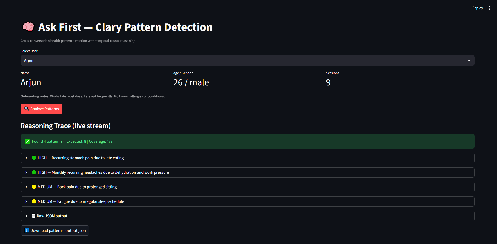
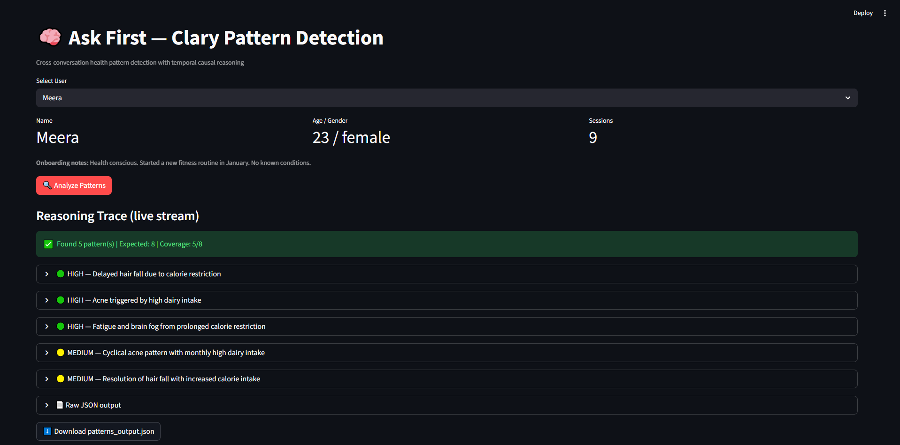
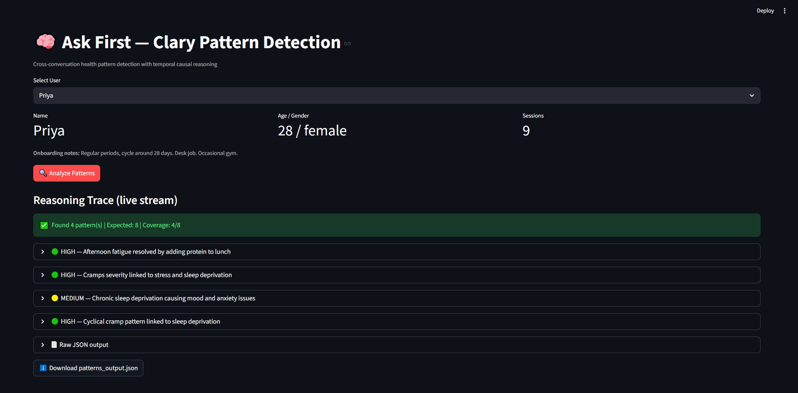

# Ask First — Clary Pattern Detection

> AI-powered cross-conversation health pattern detection with temporal causal reasoning, built on GPT-4o and Streamlit.

---

## What It Does

Clary analyzes a user's full multi-month health conversation history and surfaces **hidden, delayed, and cyclical health patterns** that would be invisible when looking at any single session in isolation.

It doesn't just find correlations — it reasons about **causation through time**, calculating exact week-gaps between events and applying clinical mechanisms (e.g., telogen effluvium, cortisol-prostaglandin interactions) to justify each pattern.

---

## Key Features

| Feature | Detail |
|---|---|
| 🧠 Temporal causal reasoning | GPT-4o reasons across timestamps, not just sequence |
| 📡 Live streaming trace | Reasoning is streamed to the UI in real time before final output |
| 🔎 8 hidden patterns | Detects delayed-onset, cyclical, compounding, and dose-response patterns |
| 🎯 Confidence calibration | Auto-downgrades `high` → `medium` when fewer than 3 sessions support a pattern |
| 🔁 Retry logic | JSON parse retried up to 3 times on malformed output |
| ⬇️ Download output | One-click export of all detected patterns as `patterns_output.json` |

---

## Demo Users

The app ships with a synthetic 3-user dataset covering ~3 months of health conversations each.

| User | ID | Profile |
|---|---|---|
| Arjun | USR001 | Software engineer, stress & deadline-driven symptoms |
| Meera | USR002 | Teacher, hormonal & dietary patterns |
| Priya | USR003 | Student, sleep-deprivation & cycle-linked symptoms |

---

## Screenshots

**Arjun (USR001)**


**Meera (USR002)**


**Priya (USR003)**


---

## Setup

### 1. Install dependencies

```bash
pip install openai streamlit python-dotenv
```

### 2. Add your OpenAI API key

Create a `.env` file in the project root:

```
OPENAI_API_KEY=your_key_here
```

### 3. Run the app

```bash
streamlit run app.py
```

Open [http://localhost:8501](http://localhost:8501) in your browser.

---

## How It Works

### Architecture

```
Synthetic Dataset (JSON)
        │
        ▼
build_user_context()   ← Formats full 3-month session history with timestamps
        │
        ▼
GPT-4o (streaming)     ← Single-shot call with full history + temporal reasoning prompt
        │
        ▼
parse_json()           ← Extracts JSON array, retries up to 3× on parse failure
        │
        ▼
calibrate_confidence() ← Downgrades "high" → "medium" when session count < 3
        │
        ▼
Streamlit UI           ← Renders pattern cards with reasoning trace + download button
```

### Design Decisions

**Full history in a single call (no chunking)**
Chunking would break temporal reasoning. A pattern where cause and effect are 6–8 weeks apart would be split across chunks and never connected. The dataset is small enough that single-shot is both feasible and correct.

**Streaming reasoning trace**
The model's consideration process is visible before the final JSON is produced. This surfaces where the model is uncertain or over-reaches — it's diagnostic, not cosmetic.

**Confidence calibration**
The model self-reports confidence, which is unreliable at low session counts. A post-processing step overrides `high` → `medium` when fewer than 3 sessions back a pattern, regardless of what the model claimed.

### Pattern Output Format

Each detected pattern is a JSON object:

```json
{
  "pattern_id": "P1",
  "user": "USR001",
  "title": "Deadline-triggered stomach pain",
  "sessions_involved": ["S02", "S05", "S07"],
  "temporal_reasoning": "Stomach complaints appear within 3–5 days of sprint deadlines across 3 separate months...",
  "reasoning_trace": "Ruled out dietary cause — no change in food across sessions. No stomach complaints in S01, S03, S04 (non-deadline weeks).",
  "confidence": "high",
  "confidence_justification": "3 sessions, consistent trigger, clear negative evidence in non-deadline sessions"
}
```

---

## Known Limitations

- **Timestamp arithmetic**: The model reasons about time gaps but does not compute them with mathematical precision. A pre-computed delta table would make this exact.
- **Absence-of-evidence**: The model may not always cite sessions where a symptom was *absent* as negative evidence.
- **Short histories**: Confounding variables that naturally separate over 3 months may collapse into a single pattern in shorter histories.

See [`one_page_writeup.md`](one_page_writeup.md) for a full analysis of failure modes and future improvements.

---

## Project Structure

```
├── app.py                          # Main Streamlit app
├── askfirst_synthetic_dataset.json # Synthetic 3-user health dataset
├── one_page_writeup.md             # Reasoning approach & known failure modes
├── arjun.png                       # Screenshot — USR001
├── meera.png                       # Screenshot — USR002
├── priya.png                       # Screenshot — USR003
├── .env                            # API key (not committed)
├── .gitignore
└── README.md
```

---

## Model

**GPT-4o** — chosen for strong structured JSON output, large context window (fits 3 months of conversation history comfortably), and native token streaming support.
